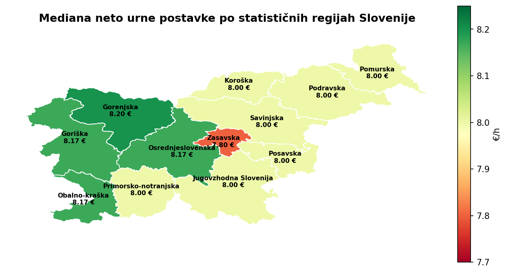
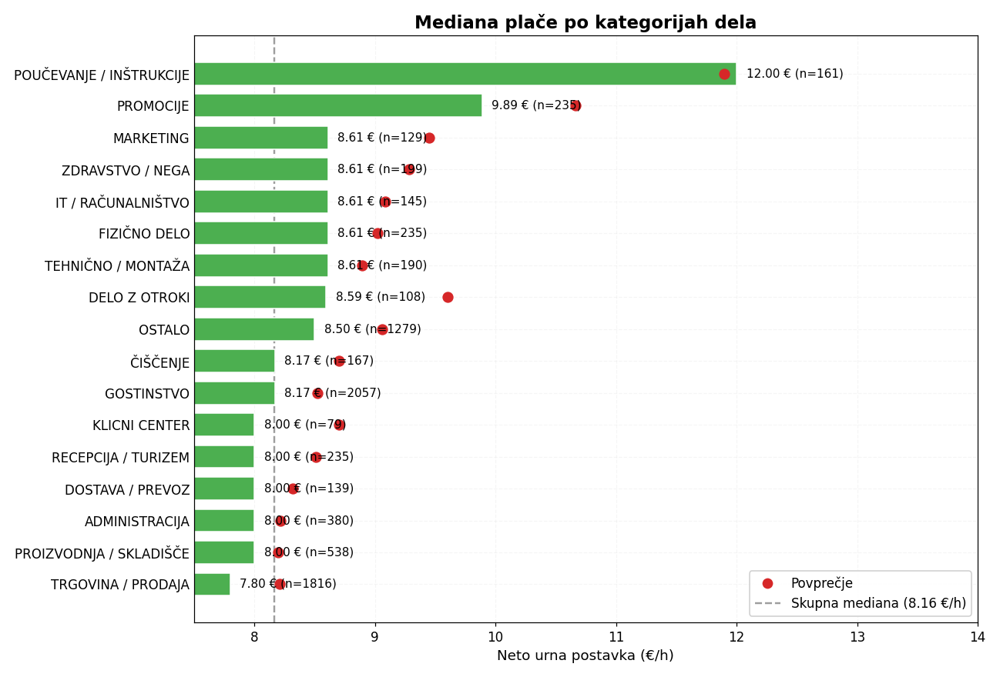
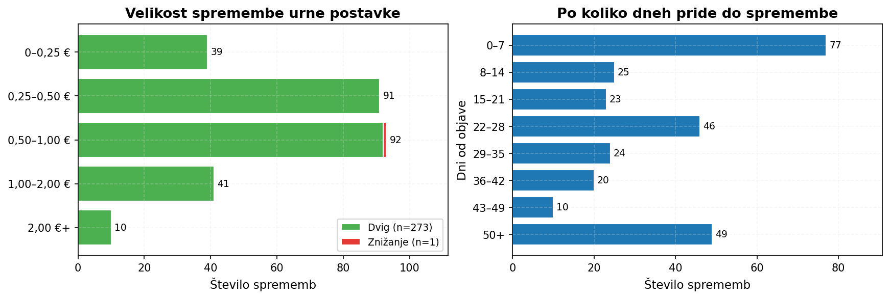
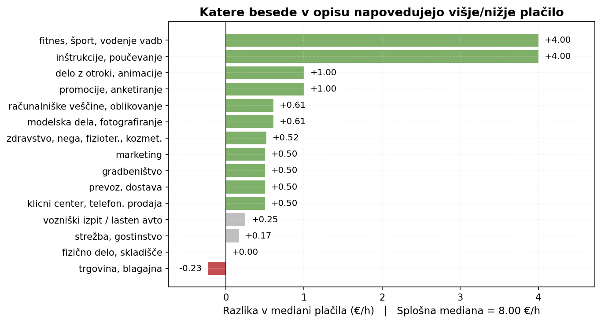
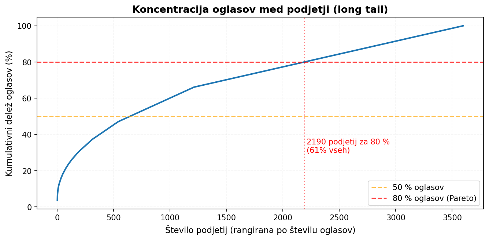

# Analiza ponudbe študentskega dela v Sloveniji

## Uvod

E-Študentski servis je največji portal za študentsko delo v Sloveniji, a obiskovalec na
njem vidi le seznam trenutno aktivnih oglasov. Iz takšnega pogleda ni mogoče razbrati, kje
so plače najboljše, katere veščine se nagrajujejo in kako se ponudba spreminja skozi čas,
saj se umaknjeni oglasi izgubijo, vzorci pa se pokažejo šele iz celotne zgodovine ponudbe.
Naš projekt to zgodovino sistematično gradi: od marca 2026 portal dnevno scrapamo, podatke
očistimo in iz njih izluščimo razlike in trende, ki jih portal sam ne pokaže. V tem poročilu
predstavimo glavni prispevek projekta, lastno podatkovno zbirko, in pet ugotovitev, ki
najbolj koristijo iskalcem in ponudnikom študentskega dela.

## Podatki: lastna zbirka 7045 oglasov

Glavni prispevek projekta je sama podatkovna zbirka. E-Študentski servis ne ponuja API-ja
in prikazuje le trenutno aktivne oglase, zato je sistematično spremljanje trga možno samo
z lastnim scrape-anjem. Scraper teče na GitHub Actions vsak dan ob 20:00 in je v obdobju
od **12. marca do 15. maja 2026** zbral **7.045 unikatnih oglasov** od **3.598 različnih
delodajalcev**. Polje neto urne postavke je izpolnjeno pri **94 %** oglasov, ostali navajajo
drug tip plačila.

Zbirka je dvodelna. Datoteka `data.csv` ima eno vrstico na oglas in vključuje strukturirane
atribute (naslov, podjetje, lokacija, plačilo, delovnik, trajanje), prosto besedilo opisa
ter časa prvega in zadnjega opažanja. Datoteka `changes.csv` vsako spremembo polja na
obstoječem oglasu zabeleži kot ločeno vrstico s prejšnjo in novo vrednostjo. Druga datoteka
omogoča analize, ki iz pogleda na portal niso mogoče: denimo, ali in kako pogosto
delodajalci dvigujejo postavke (ugotovitev 2). V predobdelavi smo lokacije
normalizirali v naselja in 12 statističnih regij, plačila pa v standardizirane kategorije
(urno, projektno, po dogovoru, na dogodek, na izlet, drugo). Pred besedilno analizo opisov
smo odstranili podvojene oglase (nekateri delodajalci ponavljajo isti oglas za različne
lokacije, kar bi v modelu povzročilo lažni signal), manjkajoče kategorialne vrednosti pa
zapolnili z `NEZNANO` ali `OSTALO`. Ker portal po umiku oglasa njegovih podatkov ne ohranja, je
naša zbirka edini vir za spremljanje trga skozi čas. Podrobna shema podatkov je v [osnutku projekta](osnutek.md).

## Glavne ugotovitve

### 1. Vsebina dela poganja plačo, lokacija skoraj nič

Razlike v plačah po regijah so presenetljivo majhne. Mediana neto urne postavke se po 12
statističnih regijah giblje od **7,80 €/h v Zasavski** do **8,20 €/h v Gorenjski**, razpon
torej znaša le **0,40 €/h**. Pričakovanja, da je v Ljubljani plača opazno boljša, podatki
ne potrdijo: Osrednjeslovenska je nad mediano le za 17 centov. Razlog je sistemski: zakonsko
določena minimalna neto postavka (7,73 €/h) je spodnja meja, ki ji večina oglasov v vseh
regijah sledi, kar zoži prostor za regionalne razlike.

Pravo razliko prinese vrsta dela. **Poučevanje** ima mediano **11,99 €/h** (50 % nad
splošno mediano), **gostinstvo 8,17 €**, **prodaja 8,00 €**, **proizvodnja 7,74 €**. Razpon
med kategorijami presega **4 €/h**, torej **desetkrat več** kot razpon po regijah. Za
študenta je tako bolj pomembno, *kakšno* delo opravlja, kot pa *kje* ga opravlja.

### 2. Plače gredo skoraj samo navzgor

Od **274 sprememb urne postavke**, ki smo jih zaznali na že objavljenih oglasih, je bilo
**273 dvigov in eno samo znižanje**, torej 99,6 % v eno smer. Tipičen dvig znaša
**0,68 €/h** (mediana), največji v zbirki **7,09 €/h**. Največ dvigov se nahaja v intervalu
od 0,50 do 2,00 €/h, kar ustreza preskoku za eno do dve interne stopnje postavk.

Dvigi pridejo z opaznim časovnim zamikom. Polovica se jih zgodi v razponu **6 do 40 dni**
od prve objave, z mediano pri **25 dneh**. Delodajalec postavke ne dvigne ob prvih dneh
slabšega odziva, ampak šele po več tednih. Pri oglasih, ki na portalu ostajajo aktivni več
tednov, se študentu splača počakati: postavka se pogosto popravi navzgor, skoraj nikoli ne
nižje.

### 3. Besedilo oglasa napove plačo bolje kot strukturirani atributi

Vprašanje napovedovanja plače smo razdelili v dva koraka. Prvi je razumljiv: preveri 15
ročno izbranih besednih značk in primerja mediano plače z in brez prisotnosti značke v
oglasu. Najmočnejši pozitivni signali so **inštrukcije in poučevanje (+4,00 €/h)**, **fitnes
in vodenje vadb (+4,00)**, **promocije (+1,00)** in **delo z otroki (+1,00)**. Edini izrazito
negativen signal je **trgovina, blagajna in polnjenje polic (−0,23 €/h)**. Logistična
regresija na teh 15 značkah doseže **ROC-AUC 0,67**, kar potrjuje, da signali niso slučajni.

Drugi korak primerja tri klasifikatorje za napoved razreda plače (nizka/srednja/visoka po
33./66. percentilu). Modele smo trenirali na 80 % stratificirano vzorčenih oglasov in
evalvirali na preostalih 20 %; v Koraku 1 smo z 5-kratnim prečnim preverjanjem ocenili
stabilnost ROC-AUC, v Koraku 2 pa kakovost merili s kontingenčno tabelo in
`classification_report`-om (precision, recall, F1 po razredu), ne le s skupno točnostjo. Trivialni baseline, ki vedno
napove najpogostejši razred, doseže
**37,6 %**. Model na strukturiranih atributih (vrsta dela, regija, urnik, trajanje, dolžina
opisa) ga prekaša s **44,9 %**. Model na celotnem besedilu (TF-IDF + logistična regresija)
pa doseže **50,2 %**. Razlika **5,3 odstotne točke** med besedilom in strukturiranimi
atributi potrjuje hipotezo, da opis nosi specifike (zahtevane veščine, vrsta naloge), ki jih
kategorialna polja izpustijo. Najmočnejše besede iz modela potrdijo prvi korak: pri visoki
plači dominirajo *poučevanje*, *trženje*, *promocija*, *izobraževanja*; pri nizki *prodaja*,
*pomoč prodaji*, *dostavo*.

### 4. Trg je izrazito fragmentiran

V dveh mesecih je oglase objavljalo **3.598 različnih podjetij**. Pričakovali smo zmerno
koncentracijo, a podatki kažejo skrajno razdrobljenost: **66 % podjetij (2.387) ima v
zbirki le en oglas**, največje (Mercator z 259 oglasi) zaseda **3,7 %** trga, top 10
delodajalcev skupaj le **11 %**. Klasično Pareto pravilo 80/20 tu odpove: za 80 % oglasov
potrebujemo **2.190 podjetij**, kar je **61 %** vseh delodajalcev.

Geografska slika je obratna: **42 % vseh oglasov** je v Osrednjeslovenski regiji, sledita
Gorenjska (10,8 %) in Podravska (10,0 %). Trg je torej geografsko skoncentriran v Ljubljani
in okolici, strukturno pa razpršen med veliko manjših delodajalcev, ki študentsko delo
potrebujejo le občasno.

### 5. Vrh novih objav v začetku tedna

Število novih oglasov je močno odvisno od dneva v tednu. Povprečno največ se jih pojavi v
**ponedeljek (142)** in **torek (114)**, sredina tedna pade na okrog **100**, četrtek na
**88**. Ob vikendih in praznikih (1. maj, 27. april) novih oglasov praktično ni:
e-Študentski servis ob teh dneh očitno ne objavlja ali sinhronizira novih oglasov. Praktična
posledica za iskalca je preprosta: portal je smiselno preverjati v ponedeljek,
ko prispe največ sveže ponudbe.

## Streamlit aplikacija

Interaktivni del projekta je Streamlit aplikacija s petimi stranmi. **Explorer** ponuja
filtre po regiji, kategoriji in razponu plače z interaktivnim zemljevidom Slovenije.
**Plače in vsebina** prikazuje primerjave plač po atributih ter interaktivno verzijo
analize ključnih besed iz ugotovitve 3. **Dinamika trga** kaže časovno vrsto novih oglasov
in seznam dvigov plač iz `changes.csv`. **Napovedovalec plače** sprejme strukturirane
atribute ali prosti opis dela, z modelom iz ugotovitve 3 napove razred urne postavke in
prikaže najbolj podobne resnične oglase iz zbirke. Aplikacija je dostopna na
[pr2608.streamlit.app](https://pr2608.streamlit.app/).

## Omejitve in nadaljnje delo

Obdobje opazovanja (dva meseca) je za nekatere časovne hipoteze prekratko: hipoteze, da se
bolje plačani oglasi hitreje zapolnijo, ne moremo zavrniti ali potrditi, ker je ob koncu
zbiranja **47 %** oglasov še aktivnih. Kategorizacija dela temelji na ključnih besedah v
naslovih, kar oglase s splošnimi naslovi (npr. zgolj "POMOČ" ali "DELO") potisne v razred
`OSTALO`. Pri napovednem modelu (ugotovitev 3) sami diagnosticiramo šibko obliko label
leakage: opisi ponovijo postavko v evrih, ki je v strukturiranem polju že zajeta, in model
jo razbere kot signal. V naslednji iteraciji to omilimo z regex filtrom za samostojna
števila pred vektorizacijo.

Scraper teče samodejno na GitHub Actions in ga lahko pustimo aktivnega po zaključku
predmeta. Pri trenutni hitrosti (~112 novih oglasov dnevno) bi v enem letu nastala zbirka
**~40.000 unikatnih oglasov**, kar bi naslednji generaciji omogočilo analize, ki jih z
dvomesečnim oknom ne moremo izvesti: sezonska nihanja, dolgoročna gibanja postavk in
dinamika podjetij.
