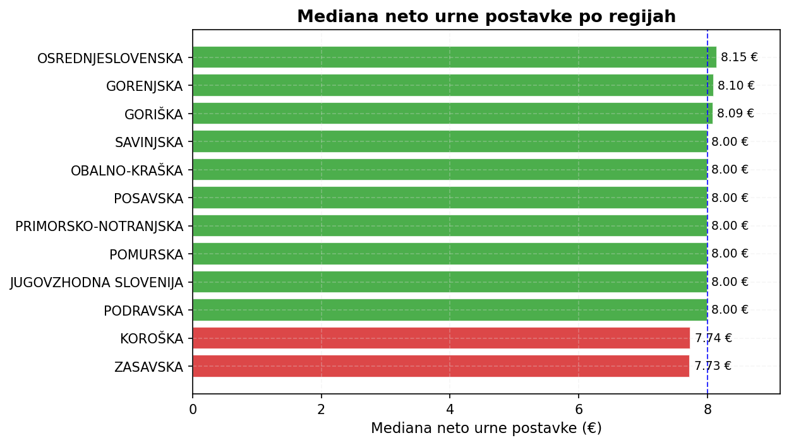
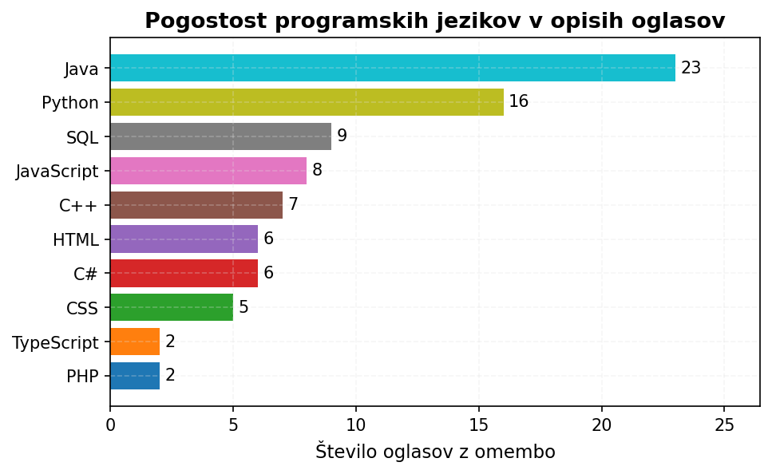
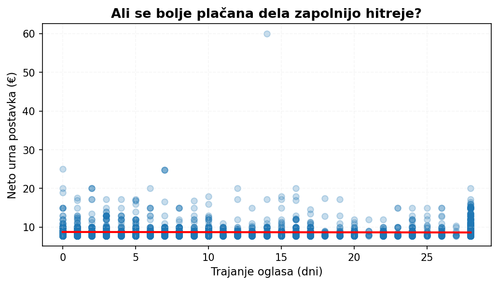

# Vmesno poročilo: Analiza ponudbe študentskega dela v Sloveniji

## Uvod

V osnutku projekta smo predstavili problem, cilje, vir podatkov in podatkovno shemo ([`osnutek.md`](osnutek.md)). To
vmesno poročilo povzema napredek pri zbiranju podatkov in ključne ugotovitve analiz, izvedenih do sredine aprila 2026.
Osredotočamo se na tri sklope: analizo plačilnih pogojev, vsebino oglasov in dinamiko trga študentskega dela.

## Zbrani podatki

Od začetka marca 2026 z avtomatskim dnevnim scrapanjem portala e-Študentski servis zbiramo oglase za študentsko delo po
celotni Sloveniji. Scraper se izvaja vsak dan ob 20:00 in rezultate samodejno shrani v Git repozitorij. Ker portal
prikazuje le trenutno aktivne oglase, je sprotno zbiranje edini način za spremljanje dinamike objavljanja in
odstranjevanja.

Do sredine aprila smo zbrali 4423 unikatnih oglasov ter v ločeni datoteki zabeležili spremembe pri obstoječih oglasih.
Ugotovili smo, da portal novih oglasov ne objavlja ob vikendih. Med tednom se v povprečju pojavi 94 novih oglasov
dnevno, ob sobotah in nedeljah pa nič. Od vseh zajetih oglasov ima 93 % navedeno neto urno postavko; preostali navajajo
plačilo po dogovoru, na projekt ali na dogodek.

V okviru predprocesiranja smo surove lokacije normalizirali v imena naselij in 12 statističnih regij s pomočjo
referenčne tabele. Zapise plačil smo normalizirali v standardizirane kategorije (urno, projektno, po dogovoru in druge),
kar omogoča primerljive agregacije po regijah, mestih in kategorijah del.

## Analiza plač

### Urne postavke po regijah

Mediana neto urne postavke med vsemi oglasi z urnim plačilom znaša 8 €, povprečje pa 8,69 €. Najvišja zabeležena
postavka je 60 €. Razlika med povprečjem in mediano nakazuje, da porazdelitev vsebuje osamelce, ki dvigujejo povprečje
navzgor.

Razporeditev median po statističnih regijah je presenetljivo enakomerna: gibljejo se od 7,73 € v Zasavski do 8,15 € v
Osrednjeslovenski regiji, kar pomeni razpon le 0,42 €. Lokacija torej na višino plačila vpliva bistveno manj, kot bi
pričakovali. Razlog je verjetno v tem, da večina urnih postavk izhaja iz zakonsko določenega minimuma za študentsko
delo, kar zoži prostor za regionalne razlike.

### Vpliv atributov na plačilo

Primerjava plač po kategorijah dela razkrije znatne razlike. Najvišjo mediano neto urne postavke dosegajo oglasi za
poučevanje in inštrukcije (11,19 €), sledijo promocijske aktivnosti (10,00 €). Na drugem koncu lestvice so proizvodna
dela z mediano 7,74 €. Razpon median po kategorijah (3,45 €) je osemkrat večji od razpona po regijah (0,42 €),
kar pomeni, da vrsta dela na plačilo vpliva bistveno bolj kot lokacija. Število prostih mest na urno postavko ne
vpliva — mediana znaša 8 € ne glede na to, ali ima oglas eno, do pet ali več kot pet prostih mest.

### Dvigovanje plač

Iz datoteke sprememb smo proučili, ali delodajalci dvigujejo urne postavke, ko oglasa ne morejo zapolniti. Med vsemi
zaznanimi spremembami neto urne postavke ni bilo niti enega znižanja — vse so bili dvigi. Povprečen dvig znaša približno
1 €, največji pa 6 €. Do dvigov praviloma pride po približno 14 dneh od objave. To nakazuje, da delodajalci zvišajo
ponudbo šele, ko začetna postavka ne pritegne dovolj kandidatov. Za študente to pomeni, da se pri nekaterih oglasih
splača počakati na boljšo ponudbo.

## Vsebina in dinamika trga

### Programski jeziki v opisih

Z regex analizo opisov oglasov smo preverili, kolikšen delež omenja kakšen programski ali poizvedovalni jezik. Le okoli
1 % oglasov eksplicitno navaja programski jezik, kar kaže, da je povpraševanje po programerskih veščinah na trgu
študentskega dela majhno. Med omenjenimi jeziki prevladuje Java (23 oglasov), sledijo Python (16), SQL (9) in
JavaScript (8). Analiza zajema le eksplicitne omembe — oglasi, ki navajajo splošno »programiranje« brez konkretnega
jezika, niso zajeti.

### Struktura trga

Na portalu je v obdobju opazovanja objavljalo 2579 različnih podjetij. Največ oglasov je objavil Mercator (188), sledita
Lidl (101) in Alpe-Panon (71). Kljub temu tri največja podjetja skupaj pokrivajo le 8 % vseh oglasov, deset največjih pa
12 %. Trg je izrazito fragmentiran: kar 73 % podjetij (1880 od 2579) ima le en objavljen oglas. To je pričakovano —
večina manjših podjetij študentsko delo potrebuje le občasno za posamezne pozicije, zato nimajo več raznolikih objav.

Geografsko prednjačijo Ljubljana (1400 oglasov), Maribor (265) in Kranj (127); po regijah pa Osrednjeslovenska (1915),
Gorenjska (481) in Podravska (455). Osrednjeslovenska regija tako zajema 43 % vseh oglasov, kar odraža koncentracijo
gospodarskih dejavnosti v prestolnici in okolici.

### Trajanje dela po kategorijah

Portal ponuja le dve glavni kategoriji trajanja: »dlje časa« in »po dogovoru«. Pri večini vrst del (trgovina,
gostinstvo, fizična dela) prevladuje trajanje za dalj časa, kar nakazuje, da delodajalci pri študentskem delu iščejo
dolgoročnejše sodelovanje. Groba členitev trajanja na portalu omejuje podrobnejšo analizo tega atributa.

### Plačilo in hitrost zapolnjevanja

Preverili smo hipotezo, da se bolje plačani oglasi zapolnijo hitreje in zato na portalu ostanejo krajši čas. Korelacija
med neto urno postavko in trajanjem prisotnosti oglasa je praktično nič, trendna črta pa je skoraj vodoravna. Višje
plačilo torej ne vodi do hitrejšega zapolnjevanja. Ker ob času analize mnogi oglasi še ostajajo aktivni, bomo hipotezo
ponovno preverili, ko bo obdobje opazovanja daljše in bo več oglasov že zaključenih.

## Nadaljnje delo

Zbiranje podatkov se nadaljuje in bo trajalo do konca semestra. Daljše obdobje opazovanja bo izboljšalo zanesljivost
časovnih analiz, zlasti o trajanju oglasov glede na vrsto dela in dinamiki objavljanja po posameznih dnevih v tednu. V
končnem poročilu načrtujemo tudi poglobljeno besedilno analizo opisov del, podrobnejšo primerjavo tipov del po regijah
ter analizo plač glede na kombinacije več atributov hkrati.
